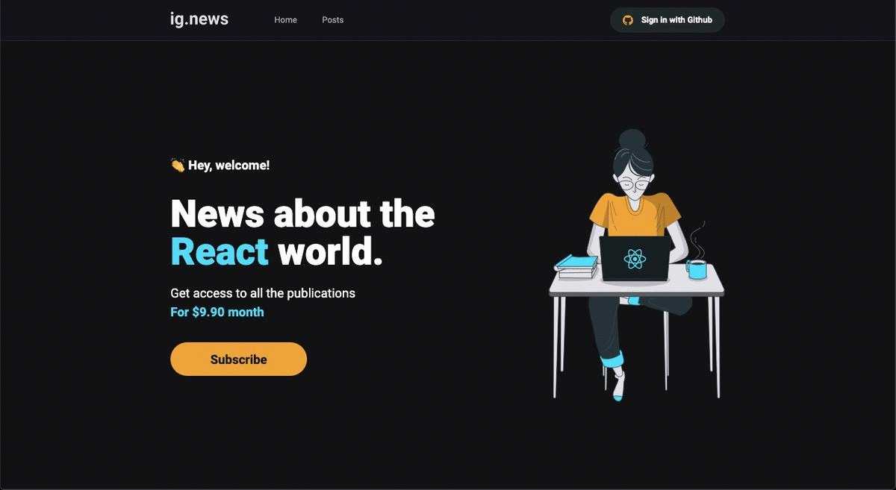

    <h1>Ig.news</h1>
    
📰 News about the React world.

    

    

        
        
        
        
    

    

# Deploy
[Ig.news](https://ignews-kxhw1lfjo-paulorcvieira.vercel.app/)

 

# About

An application where the user can subscribe to text content, like a newsletter in the case related to news about the world of React and the ecosystem it has.

# Techs

 - [Next.js](https://nextjs.org/) 
 - [Stripe](https://stripe.com/) 
 - [FaunaDB](https://fauna.com/) 
 - [React.js](https://reactjs.org/)
 - [TypeScript](https://www.typescriptlang.org/)

# Requirements

- [Git](https://git-scm.com/) installed
- [Node](https://node.js.org/) installed
- Npm or [Yarn](https://yarnpkg.com/) installed

# Usage

- Run `yarn install`.
- Run `yarn dev` and access `http://localhost:3000`

# Author

- [paulorcvieira](https://github.com/paulorcvieira)

 
 
 
 

  <h1>Open Source</h1>
  Copyright © 2021-present, paulorcvieira.
  
Ig.news <a href="https://github.com/paulorcvieira/ignews-nextjs-api-routing-fauna-stripe/tree/dev/LICENSE">is MIT licensed </a>

